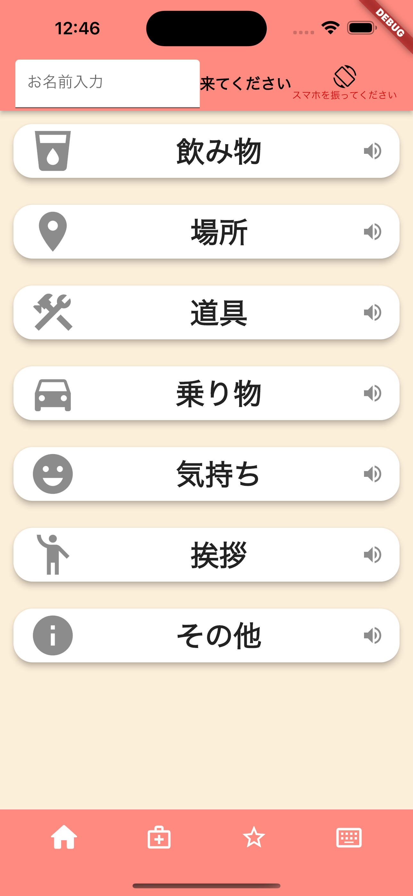
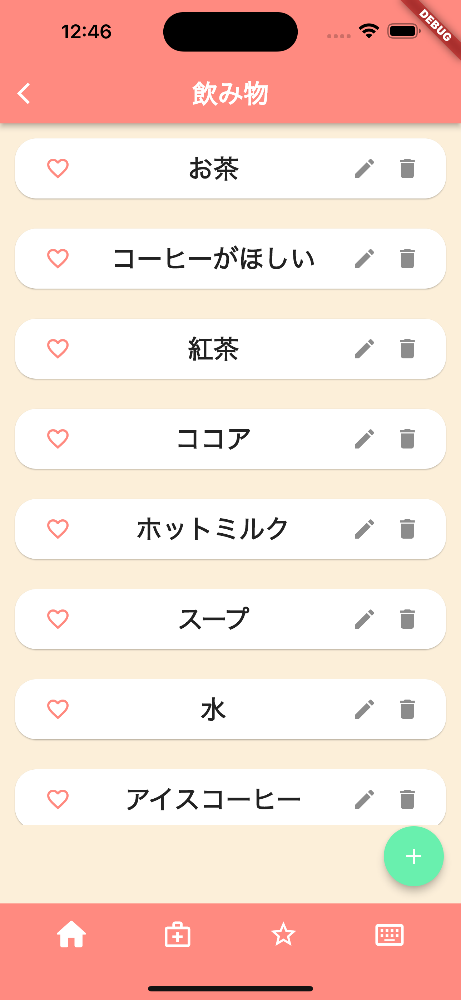
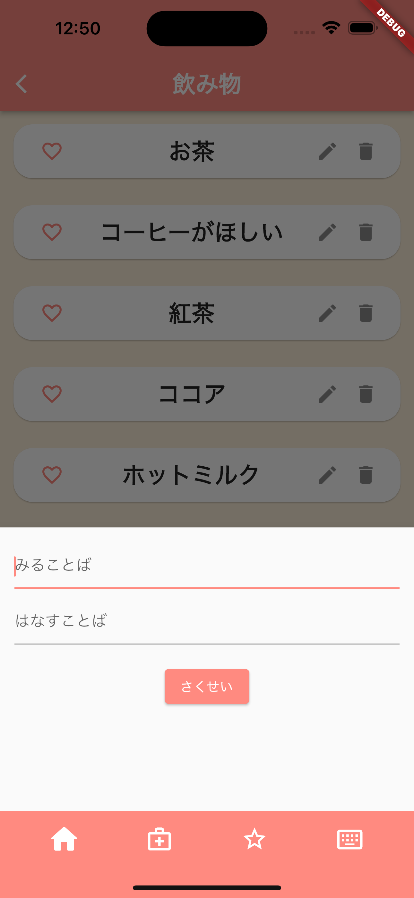
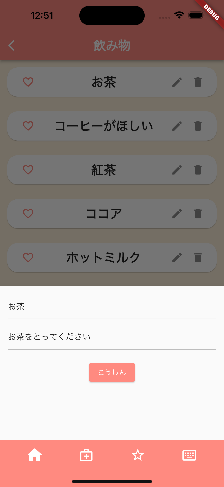
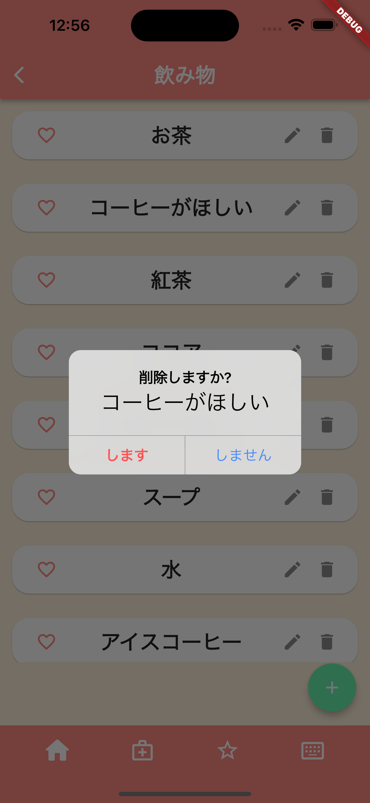
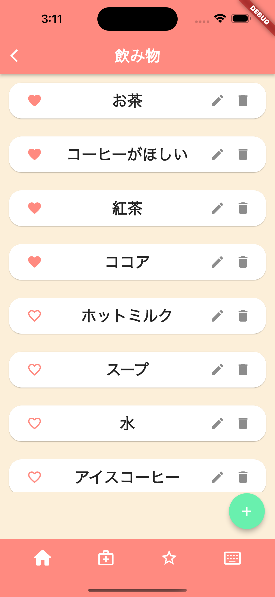
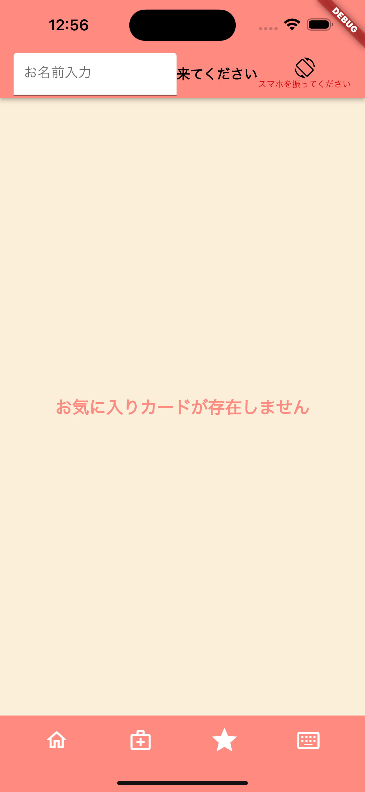
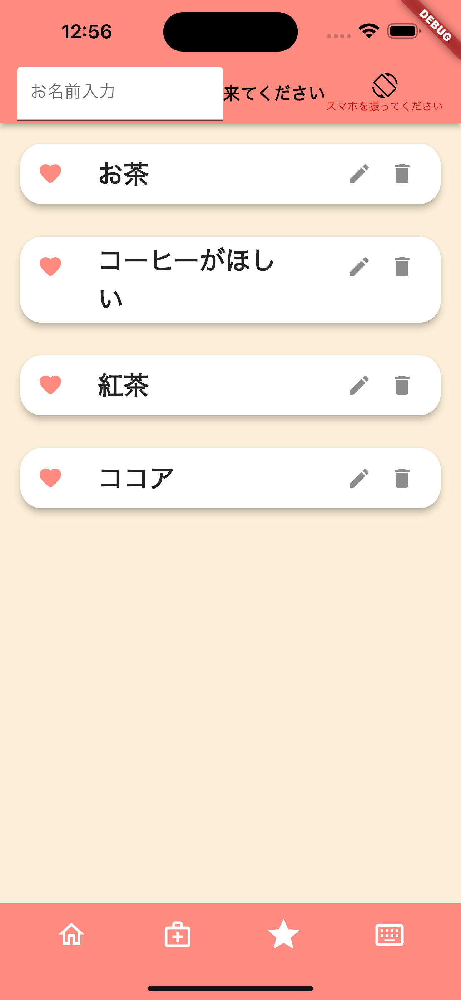
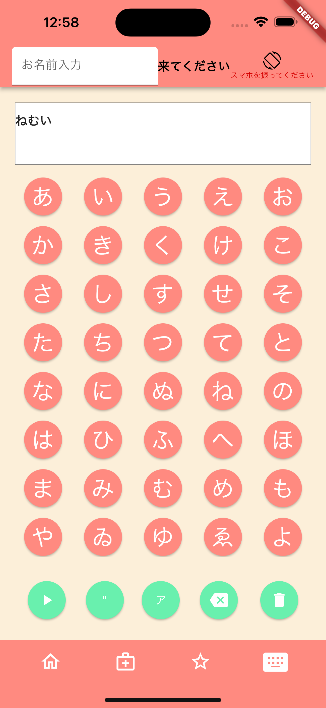

# **音声通話補助アプリケーション**

**このアプリは､日常で利用する言葉をカードとして記憶させ､ボタンを押すことで音声となって､出力するといった日々の会話のサポートをするアプリです**

## 目次
- [**音声通話補助アプリケーション**](#音声通話補助アプリケーション)
  - [目次](#目次)
  - [機能](#機能)
  - [操作方法](#操作方法)

## 機能
- カードを押すことによって欲しい物を呼ぶことができる機能
- スマホを振ることで名前を呼ぶことができる機能
- 画面遷移及びデータを更新した際にも状態を読み上げる機能
- カードを追加できる機能
- カードを編集できる機能
- カードを削除できる機能
- フリック入力をしなくても入力することができる機能

## 操作方法

- 初期画面にアクセスすると､カテゴリー分けされたカードと名前入力欄及び他の画面へ遷移するナビゲーションバーが表示されます

- 飲み物や道具ボタンを押すことで画面が遷移し､それぞれのカードが表示されて追加､編集､削除をすることができます
- カードを下に引っ張ることで､データを更新することができます

　

- 右下にある追加アイコンを押すことで､モーダルが表示されてカードを追加できます
- カードの右から2つめの編集アイコンを押すことで､モーダルが表示されてカードを編集することができます

　

- カードの一番右にある削除アイコンを押すことで､ダイアログが表示されて削除することができます
- カードの一番左にあるお気に入りアイコンを押すことで､後述するお気に入り画面にて表示されます

　

- お気に入り画面に遷移すると前述したお気に入りカードを画面上に出力します
- 「お気に入りカードが存在しません」テキストボタンを押すことで､データを更新することができます
- 更新するとお気に入りに入れたカードが表示されます

　

- 入力画面では､フリック入力が苦手な人でも打ち込めるようにボタンを押すことで他者に伝えることもできます

